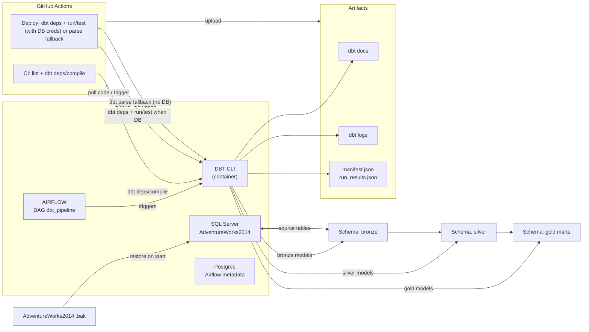

# DataOps Lab 01 – DBT & Airflow Pipeline
[](https://github.com/minhhuy27/lab01-dataops/actions/workflows/ci.yml)
[](https://github.com/minhhuy27/lab01-dataops/actions/workflows/deploy.yml)

## 1. Project Overview
- Mục tiêu: xây dựng pipeline DataOps trên AdventureWorks2014 với dbt (bronze/silver/gold), orchestrate bằng Airflow, đóng gói Docker, tự động hóa CI/CD trên GitHub Actions.
- Thành phần chính: SQL Server (AdventureWorks2014), dbt models + tests, Airflow DAG `dbt_pipeline`, Postgres metadata cho Airflow, Docker Compose, GitHub Actions.
- Luồng dữ liệu: SQL Server (raw) → dbt bronze → dbt silver → dbt gold; Airflow gọi dbt deps/run/test; CI/CD tự động lint/compile và (khi có DB) chạy dbt run/test.

## 2. System Architecture Diagram


## 3. Folder Structure
```
├─ .github/workflows/           # CI (ci.yml), Deploy (deploy.yml)
├─ airflow/
│  ├─ dags/                     # dbt_pipeline DAG
│  ├─ logs/                     # Airflow logs (mounted)
│  ├─ plugins/
│  └─ Dockerfile
├─ dbt/
│  ├─ models/bronze | silver | gold
│  ├─ profiles.yml             # local profile (docker dev)
│  ├─ packages.yml
│  └─ dbt_project.yml
├─ sqlserver/
│  ├─ Dockerfile               # khởi SQL Server + restore AdventureWorks2014
│  └─ restore_db.sh
├─ docker-compose.yml          # SQL Server, Postgres, Airflow, dbt
├─ .sqlfluff, setup.cfg        # lint configs
└─ README.md, DATAOPS_PROJECT_REQUIREMENTS.md
```

## 4. Prerequisites
- Docker & Docker Compose.
- Python (nếu muốn chạy dbt/linters ngoài container).
- Ports trống: 1433 (SQL Server), 8080 (Airflow).
- Env tùy chọn: `DBT_SQLSERVER_HOST/USER/PASSWORD/DATABASE/SCHEMA/DRIVER`, `SLACK_WEBHOOK_URL`.

## 5. Setup Guide (~30 phút)
1) Clone repo:
   ```bash
   git clone https://github.com/minhhuy27/Lab01-DevOps.git
   cd Lab01-DevOps
   ```
2) (Tùy chọn) tạo `.env` cho SQL/Slack.
3) Chạy Docker:
   ```bash
   docker compose up -d
   ```
4) Kiểm tra services:
   - Airflow UI: http://localhost:8080 (admin/admin).
   - SQL Server: localhost:1433 (SA/YourStrong@Passw0rd).
   - dbt container: `docker compose exec dbt sh`.

## 6. Running the Pipeline
- dbt (trong container):
  ```bash
  # nếu chạy lần đầu hoặc chưa có DB:
  docker compose exec sqlserver /opt/mssql-tools/bin/sqlcmd -S localhost -U SA -P YourStrong@Passw0rd -Q "RESTORE DATABASE AdventureWorks2014 FROM DISK = '/tmp/AdventureWorks2014.bak' WITH MOVE 'AdventureWorks2014_Data' TO '/var/opt/mssql/data/AdventureWorks2014.mdf', MOVE 'AdventureWorks2014_Log' TO '/var/opt/mssql/data/AdventureWorks2014_log.ldf'"

  docker compose run --rm dbt dbt deps
  docker compose run --rm dbt dbt run
  docker compose run --rm dbt dbt test
  docker compose run --rm dbt dbt source freshness
  ```
- Airflow:
  - Bật DAG `dbt_pipeline`, trigger tay trong UI.
  - Xem log trong Airflow UI hoặc thư mục `airflow/logs`.


## 7. CI/CD Summary
- CI (`ci.yml`):
  - Lint Python (black/flake8), lint SQL (sqlfluff).
  - dbt deps + compile (skip DB work), publish dbt artifacts.
  - PR validation: title format, file size, conflict markers.
- Deploy (`deploy.yml`):
  - Trigger: push `develop`/`main` hoặc manual dispatch.
  - Cài ODBC 18, khởi SQL Server container + restore AdventureWorks2014.
  - dbt deps + compile; nếu có DB secrets và bật `RUN_DB_TASKS=true` sẽ chạy dbt run/test, nếu không sẽ parse để pass pipeline.
  - Upload logs/manifest; thông báo qua GitHub summary/commit comment (nếu có quyền); Slack nếu đặt webhook.
  - Rollback: dispatch với `run_mode=rollback`.

## 8. Troubleshooting
- Không kết nối SQL Server: `docker compose logs sqlserver`; kiểm tra port 1433, SA password.
- Airflow scheduler không chạy: `docker compose logs airflow-scheduler`; đảm bảo DB init xong.
- dbt profile lỗi driver: rebuild image `dbt` (ODBC 18) bằng `docker compose build dbt`.
- GitHub Actions lỗi ODBC/SQL: xem step cài driver & restore DB trong log CI/CD; runner cần quyền Docker.

## 9. DBT docs & Lineage
Sinh và xem tài liệu/lineage:
```bash
docker compose exec dbt dbt deps
docker compose exec dbt dbt docs generate
docker compose exec dbt dbt docs serve --host 0.0.0.0 --port 8001
```
Mở http://localhost:8001 để xem catalog và DBT Lineage Graph (bronze → silver → gold).

## 10. Contributors
- Lê Tuấn Anh - MSSV: 22120011
- Nguyễn Minh Huy - MSSV: 22120137
